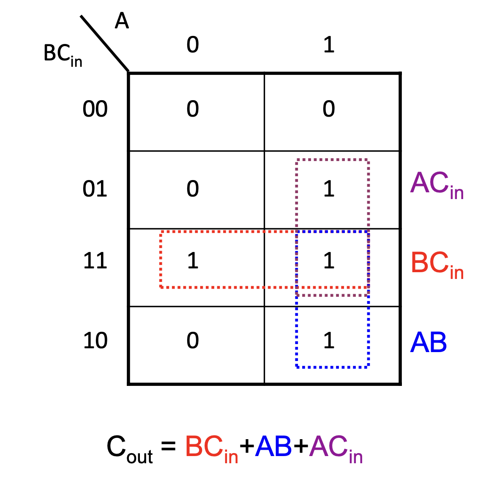

# Rechnerorganisation TU Berlin

## Negative Zahlen und Operationen woche1

[`Rechnerorganisation on isis`](https://isis.tu-berlin.de/course/view.php?id=35785)

[`TUB_cloud`](https://tubcloud.tu-berlin.de/s/YCGoWPgEYJQ6jY7)

***
### **_Möglichkeiten negative Zahlen binär zu repräsentieren:_**

<span style='color: red;'>− Vorzeichen-/Betrags-Zahlen (Sign-magnitude numbers)</span>

- MSB zeigt Vorzeichen (sign) an (0: positiv, 1: negativ).
- Die übrigbleibenden (n-1) Bits bilden den Betrag (magnitude).
- Beispiel: 5 (dezimal) = 0101 (binär) →-5 (dezimal) = 1101 (binär)
***

<span style='color: red;'>−1-Komplement-Zahlen (One’s complement numbers)</span>

- Zahl wird durch die Invertierung aller Bits negiert.
- MSB impliziert das Vorzeichen.
- Beispiel: 5 (dezimal) = 0101 (binär) →-5 (dezimal) = 1010 (binär)
***

<span style='color: red;'>− 2-Komplement-Zahlen (Two’s complement numbers)</span>

- MSB hat ein negatives Gewicht (-2n-1).
- bn-1bn-2…b1b0 (binär) = -bn-12n-1+bn-22n-2+…+b121+b020 (dezimal)
- MSB impliziert das Vorzeichen.
- Beispiel: -5 (dezimal) = -8 + 3 = 1000+0011=1011 (binär)
***

#### **Beispiel (4-Bit)**
| Dezimal | (Sign-Magnitude) | (One’s complement) | (Two’s complement) |
|---------|------------------|--------------------|--------------------|
| -0      | 1000             | 1111               |                    |
| -1      | 1001             | 1110               | 1111               |
| -2      | 1010             | 1101               | 1110               |
| -3      | 1011             | 1100               | 1101               |
| -4      | 1100             | 1011               | 1100               |
| -5      | 1101             | 1010               | 1011               |
| -6      | 1110             | 1001               | 1010               |
| -7      | 1111             | 1000               | 1001               |
| -8      |                  |                    | 1000               |

***
```
Rechenregeln(1):
- 0 + 0 = 0
- 0 + 1 = 1
- 1 + 0 = 1
- 1 + 1 = 0 (carry 1)

Rechenregeln(2):
- 0 - 0 = 0
- 0 - 1 = 1 (borrow 1)
- 1 - 0 = 1
- 1 - 1 = 0
```
***
### **_Logikminimierung_**


| A | B | Cin | Cout                                  |
|---|---|-----|---------------------------------------|
| 0 | 0 | 0   | 0                                     |
| 0 | 0 | 1   | 0                                     | 
| 0 | 1 | 0   | 0                                     | 
| 0 | 1 | 1   | <span style='color: yellow;'>1</span> |
| 1 | 0 | 0   | 0                                     | 
| 1 | 0 | 1   | <span style='color: yellow;'>1</span> | 
| 1 | 1 | 0   | <span style='color: yellow;'>1</span> | 
| 1 | 1 | 1   | <span style='color: yellow;'>1</span> |

**_▪ Beispiel:_**
– Cout = ¬ABCin+A¬BCin+AB¬Cin+ABCin

**_▪ Minimiert ergibt sich:_**
– Cout = BCin+ACin+AB
***
### **_Karnaugh-Veitch-Diagramm_**

### **_Мінімізована Дизюнктивна нормальна форма_**



Правила:

Якщо букви для елементів співпадають, пишемо їх, інакше не пишемо.

***
### **_Gebrochene Zahlen / Gleitkommazahlen_**
Darstellung gebrochener Zahlen:
▪ Beispiel (binär):
11,1010 (B) = 3 + 2^(-1) + 2^(-3) = 3 + 0.5 + 0.125 = `3,625 (D);
***
### **_Konvertierung_**
##### **_Dezimal nach Dual_**

0,24D -> 0,24 · 2 = 0,48 + 0 - MSB

0,48 · 2 = 0,96 + 0

0,96 · 2 = 0,92 + 1

0,92 · 2 = 0,84 + 1

0,84 · 2 = 0,68 + 1

0,68 · 2 = 0,36 + 1

0,36 · 2 = 0,72 + 0

0,72 · 2 = 0,44 + 1 - LSB - `0,00111101` (B);
***
### **_Überlauf_**

▪ Overflow tritt auf, wenn…

| Operation | A    | B    | Overflow wenn (Vorzeichen) des Ergebnisses | 
|-----------|------|------|--------------------------------------------|
| A + B     | ≥  0 | ≥  0 | < 0                                        |
| A + B     | < 0  | < 0  | ≥ 0                                        | 
| A - B     | ≥ 0  | < 0  | < 0                                        | 
| A - B     | < 0  | ≥ 0  | ≥ 0                                        |
***


    

